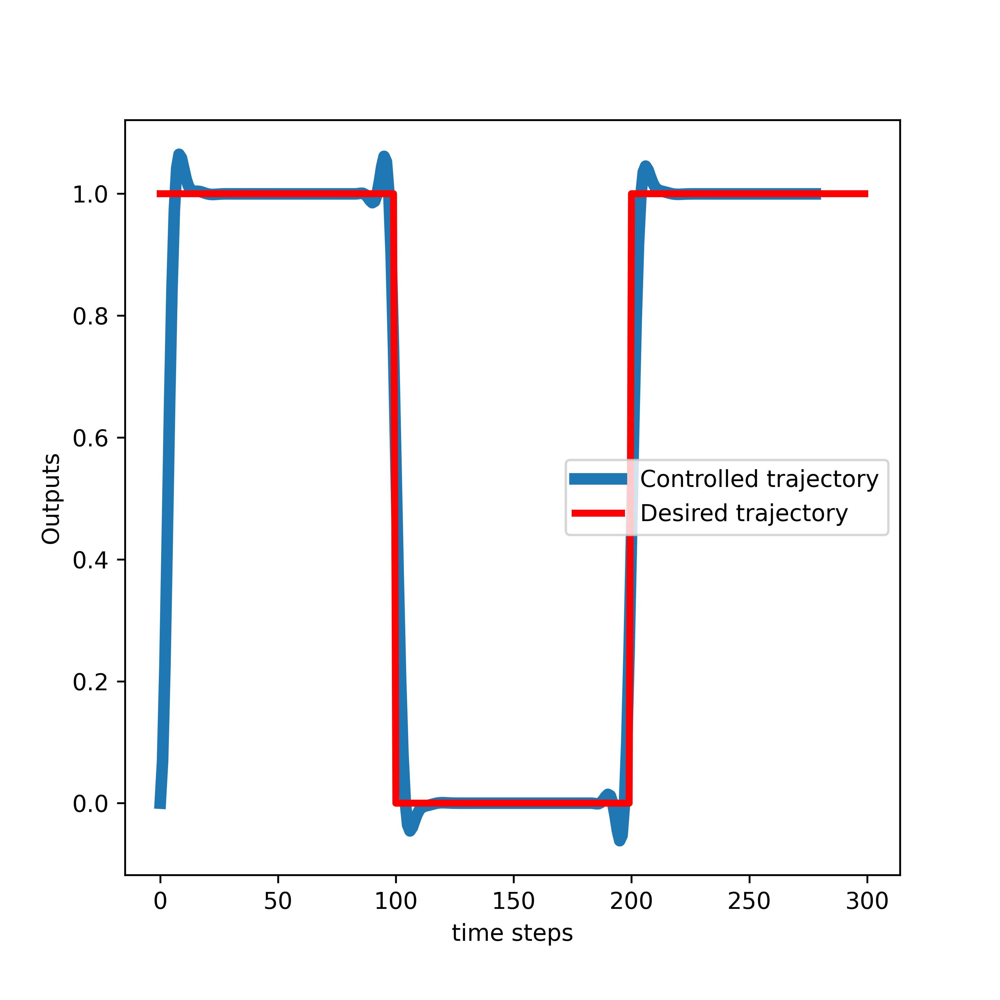

# Model-Predictive-Control-for-Linear-Systems-in-Cpp-by-Using-Eigen-Library

FIRST, READ THE LICENSE AT THE END OF THIS FILE

This repository contains C++ files that explain how to implement the Model Predictive Control (MPC) algorithm for linear systems in C++ by using the Eigen C++ matrix library.

The implemented MPC algorithm is derived and explained in this webpage tutorial:

https://aleksandarhaber.com/model-predictive-control-mpc-tutorial-2-unconstrained-solution-for-linear-systems-and-implementation-in-c-from-scratch-by-using-eigen-c-library/

The YouTube tutorial explaining the derivation and implementation is given below:

https://www.youtube.com/watch?v=fgNz1RE2DG4

TO DO AND TO IMPROVE: PASS BY CONST REFERENCE FOR SPEED.

Explanation of the posted files:

- "ModelPredictiveController.h" is the header file of the class that implements the MPC algorithm
- "ModelPredictiveController.cpp" is the implementation file of the class that implements the MPC algorithm
- "driver_code.cpp" is the driver code for the class that implements the MPC algorithm. You should run this file to generate the results. The results are saved
  in the comma-separated-value files (csv files). The files store the controlled state trajectory, controlled outputs, computed inputs, and desired trajectory. Also, these
  files store the lifted system matrices O and M.
- "visualizeResultsPython.py" is the Python file used to plot the results. This file reads the saved csv files and it plots the controlled output trajectory, desired trajectory, and applied control inputs. One of the generated graphs is shown below.

  

LICENSE: 
THIS IS NOT FREE SOFTWARE AND CODE. IF YOU WANT TO USE THIS CODE IN THE COMMERCIAL SETTING OR ACADEMIC SETTING, THAT IS, IF YOU WORK FOR A COMPANY OR IF YOU ARE AN INDEPENDENT CONSULTANT AND IF YOU WANT TO USE THIS CODE OR IF YOU ARE ACADEMIC RESEARCHER OR STUDENT, THEN WITHOUT MY PERMISSION AND WITHOUT PAYING THE PROPER FEE, YOU ARE NOT ALLOWED TO USE THIS CODE. YOU CAN CONTACT ME AT

aleksandar.haber@gmail.com

TO INFORM YOURSELF ABOUT THE LICENSE OPTIONS AND FEES FOR USING THIS CODE.
ALSO, IT IS NOT ALLOWED TO 
(1) MODIFY THIS CODE IN ANY WAY WITHOUT MY PERMISSION.
(2) INTEGRATE THIS CODE IN OTHER PROJECTS WITHOUT MY PERMISSION.

 DELIBERATE OR INDELIBERATE VIOLATIONS OF THIS LICENSE WILL INDUCE LEGAL ACTIONS AND LAWSUITS. 

